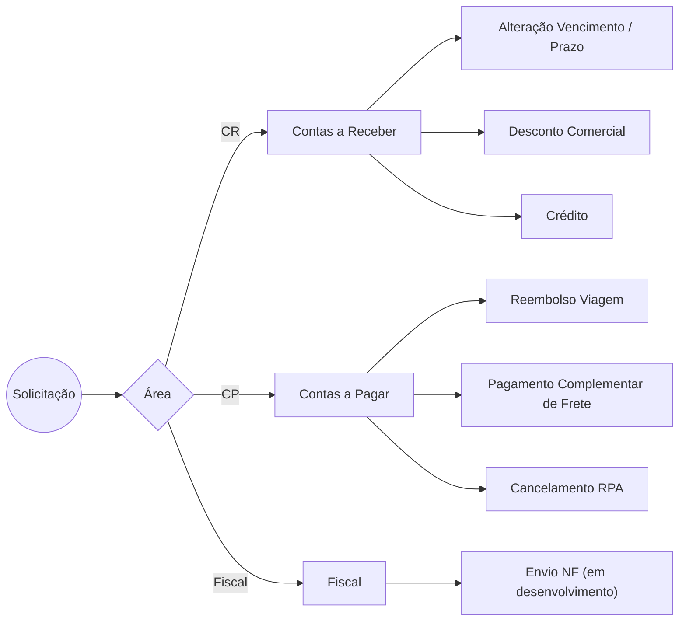

# Visão geral: roteamento das solicitações

```mermaid
flowchart LR
    START((Solicitação)) --> ROUTER{Área}
    ROUTER -->|CR| CR[Contas a Receber]
    ROUTER -->|CP| CP[Contas a Pagar]
    ROUTER -->|Fiscal| FISCAL[Fiscal]
    CR --> ALT[Alteração Vencimento / Prazo]
    CR --> DESC[Desconto Comercial]
    CR --> CRED[Crédito]
    CP --> REEMB[Reembolso Viagem]
    CP --> SOLIC[Pagamento Complementar de Frete]
    CP --> CANC[Cancelamento RPA]
    FISCAL --> NF["Envio NF (em desenvolvimento)"]
```
