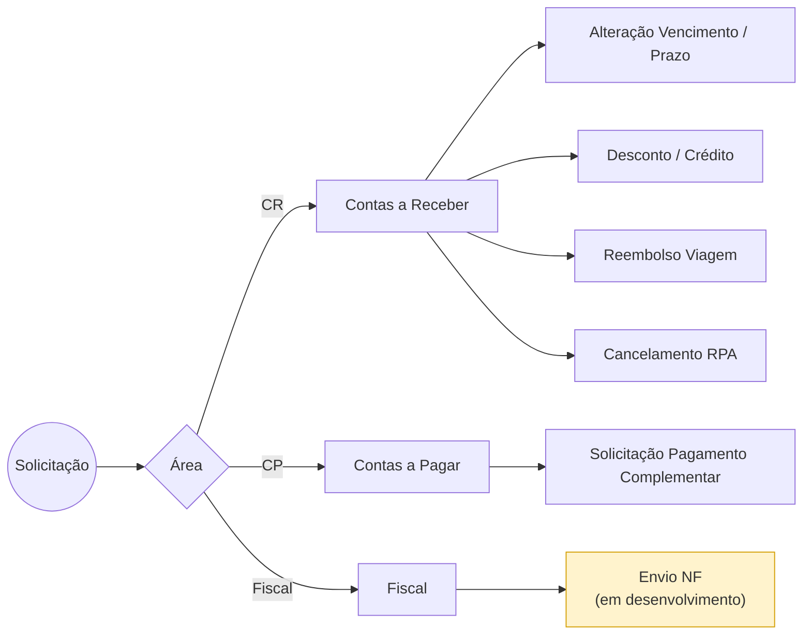

# Visão geral — Roteamento das solicitações

Ponto de entrada único que ramifica as solicitações entre as áreas
**CR (Contas a Receber)**, **CP (Contas a Pagar)** e **Fiscal**.

```mermaid
flowchart LR
    START((Solicitação)) --> ROUTER{Área}

    ROUTER -->|CR| CR[Contas a Receber]
    ROUTER -->|CP| CP[Contas a Pagar]
    ROUTER -->|Fiscal| FISCAL[Fiscal]

    CR --> ALT[Alteração Vencimento / Prazo]
    CR --> DESC[Desconto / Crédito]
    CR --> REEMB[Reembolso Viagem]
    CR --> CANC[Cancelamento RPA]

    CP --> SOLIC[Solicitação Pagamento Complementar]

    FISCAL --> NF["Envio NF<br/>(em desenvolvimento)"]

    classDef dev fill:#fff3cd,stroke:#d39e00;
    class NF dev;
```
