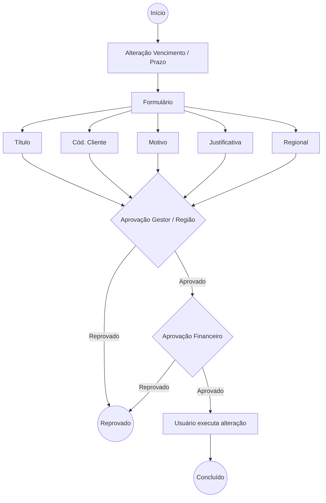

# Alteração de Vencimento / Prazo — CR

Alteração da data de vencimento ou do prazo de um título de Contas a Receber.

```mermaid
flowchart TD
    START((Início)) --> TIPO[Alteração Vencimento / Prazo]

    TIPO --> FORM[Formulário]
    FORM --> F1[Título]
    FORM --> F2[Cód. Cliente]
    FORM --> F3[Motivo]
    FORM --> F4[Justificativa]
    FORM --> F5[Regional]

    F1 & F2 & F3 & F4 & F5 --> APROV1{Aprovação Gestor / Região}
    APROV1 -->|Aprovado| APROV2{Aprovação Financeiro}
    APROV1 -->|Reprovado| FIM_REP((Reprovado))
    APROV2 -->|Aprovado| USER[Usuário executa alteração]
    APROV2 -->|Reprovado| FIM_REP
    USER --> FIM((Concluído))
```
