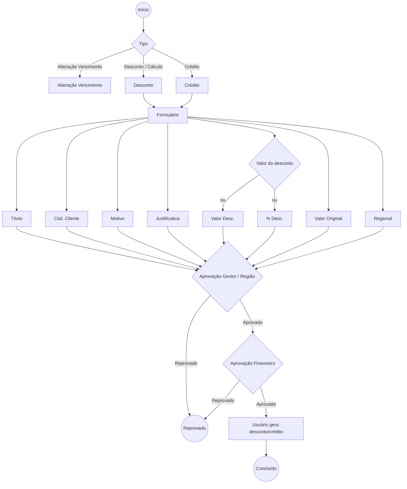

# Desconto / Crédito — CR

Concessão de desconto ou geração de crédito sobre títulos de Contas a Receber.
Fluxo com dupla aprovação (Gestor/Região e Financeiro).

```mermaid
flowchart TD
    START((Início)) --> RAMO{Tipo}
    RAMO -->|Alteração Vencimento| ALT[Alteração Vencimento]
    RAMO -->|Desconto / Cálculo| DESC[Desconto]
    RAMO -->|Crédito| CRED[Crédito]

    DESC --> FORM[Formulário]
    CRED --> FORM

    FORM --> F1[Título]
    FORM --> F2[Cód. Cliente]
    FORM --> F3[Motivo]
    FORM --> F4[Justificativa]
    FORM --> VAL{Valor do desconto}
    VAL -->|ou| V1[Valor Desc.]
    VAL -->|ou| V2[% Desc.]
    FORM --> F5[Valor Original]
    FORM --> F6[Regional]

    F1 & F2 & F3 & F4 & V1 & V2 & F5 & F6 --> APROV1{Aprovação Gestor / Região}
    APROV1 -->|Aprovado| APROV2{Aprovação Financeiro}
    APROV1 -->|Reprovado| FIM_REP((Reprovado))
    APROV2 -->|Aprovado| USER[Usuário gera desconto/crédito]
    APROV2 -->|Reprovado| FIM_REP
    USER --> FIM((Concluído))
```
