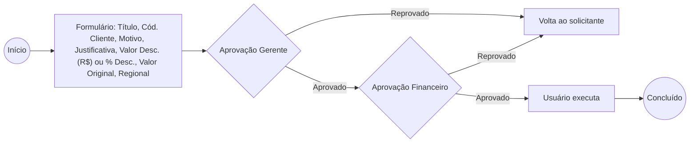

# Desconto Comercial (CR)

Desconto em R$ **ou** em %, com dupla aprovação.

```mermaid
flowchart LR
    START((Início)) --> FORM["Formulário: Título, Cód. Cliente, Motivo, Justificativa, Valor Desc. (R$) ou % Desc., Valor Original, Regional"]
    FORM --> AP1{Aprovação Gerente}
    AP1 -->|Aprovado| AP2{Aprovação Financeiro}
    AP1 -->|Reprovado| VOLTA[Volta ao solicitante]
    AP2 -->|Aprovado| USR[Usuário executa]
    AP2 -->|Reprovado| VOLTA
    USR --> FIM((Concluído))
```

O **Crédito** virou um fluxo próprio: [07-credito.md](07-credito.md).
