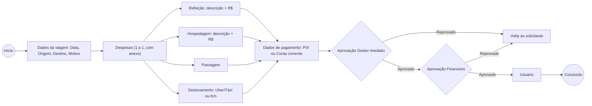

# Reembolso Viagem (CP)

Despesas lançadas **uma a uma**, cada uma com o comprovante anexado. A solicitação pode ser cancelada antes da conclusão.

```mermaid
flowchart LR
    START((Início)) --> VIAG["Dados da viagem: Data, Origem, Destino, Motivo"]
    VIAG --> DESP["Despesas (1 a 1, com anexo)"]
    DESP --> T1["Refeição: descrição + R$"]
    DESP --> T2["Hospedagem: descrição + R$"]
    DESP --> T3[Passagem]
    DESP --> T4["Deslocamento: Uber/Táxi ou Km"]
    T1 & T2 & T3 & T4 --> PG["Dados de pagamento: PIX ou Conta corrente"]
    PG --> AP1{Aprovação Gestor imediato}
    AP1 -->|Aprovado| AP2{Aprovação Financeiro}
    AP1 -->|Reprovado| VOLTA[Volta ao solicitante]
    AP2 -->|Aprovado| USR[Usuário]
    AP2 -->|Reprovado| VOLTA
    USR --> FIM((Concluído))
```
