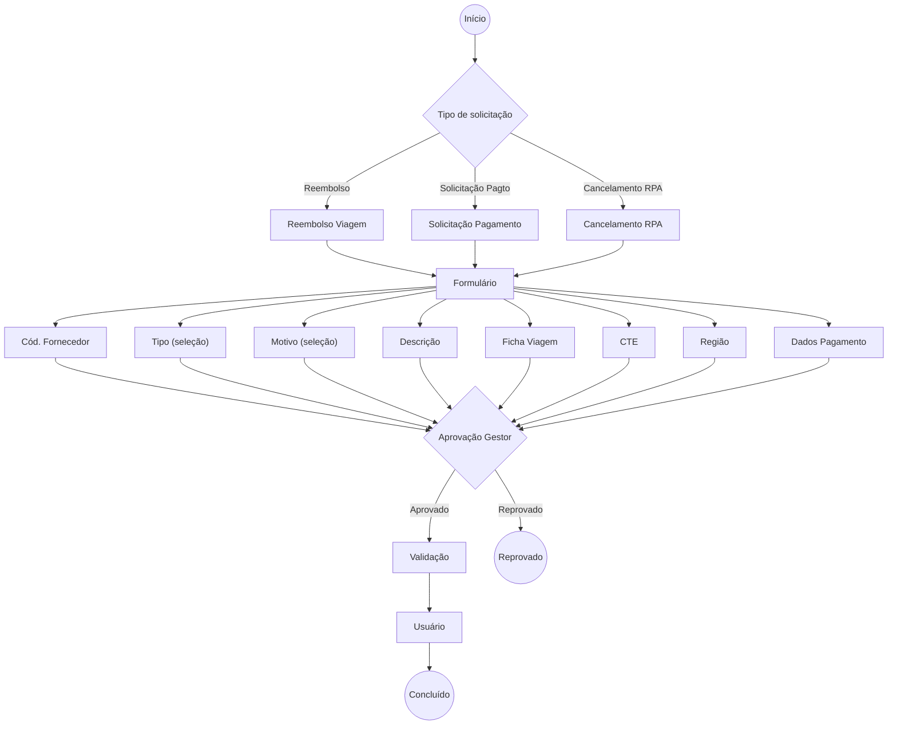

# Reembolso Viagem — CR

Solicitação de reembolso de despesas de viagem. Compartilha o mesmo formulário
e a mesma trilha de aprovação de Solicitação de Pagamento e Cancelamento RPA.

```mermaid
flowchart TD
    START((Início)) --> RAMO{Tipo de solicitação}
    RAMO -->|Reembolso| REEMB[Reembolso Viagem]
    RAMO -->|Solicitação Pagto| SOLIC[Solicitação Pagamento]
    RAMO -->|Cancelamento RPA| CANC[Cancelamento RPA]

    REEMB --> FORM[Formulário]
    SOLIC --> FORM
    CANC --> FORM

    FORM --> F1[Cód. Fornecedor]
    FORM --> F2["Tipo (seleção)"]
    FORM --> F3["Motivo (seleção)"]
    FORM --> F4[Descrição]
    FORM --> F5[Ficha Viagem]
    FORM --> F6[CTE]
    FORM --> F7[Região]
    FORM --> F8[Dados Pagamento]

    F1 & F2 & F3 & F4 & F5 & F6 & F7 & F8 --> APROV{Aprovação Gestor}
    APROV -->|Aprovado| VALID[Validação]
    VALID --> USER[Usuário]
    APROV -->|Reprovado| FIM_REP((Reprovado))
    USER --> FIM((Concluído))
```
