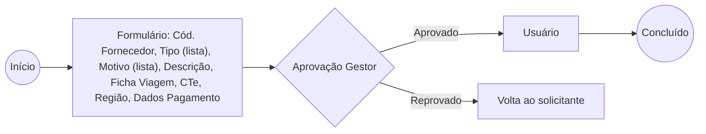

# Solicitação de Pagamento Complementar de Frete (CP)

```mermaid
flowchart LR
    START((Início)) --> FORM["Formulário: Cód. Fornecedor, Tipo (lista), Motivo (lista), Descrição, Ficha Viagem, CTe, Região, Dados Pagamento"]
    FORM --> AG{Aprovação Gestor}
    AG -->|Aprovado| USR[Usuário]
    AG -->|Reprovado| VOLTA[Volta ao solicitante]
    USR --> FIM((Concluído))
```
