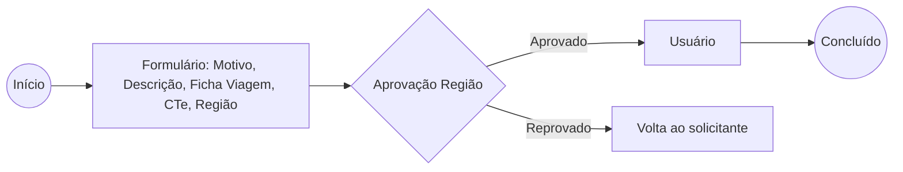

# Cancelamento RPA (CP)

```mermaid
flowchart LR
    START((Início)) --> FORM["Formulário: Motivo, Descrição, Ficha Viagem, CTe, Região"]
    FORM --> AG{Aprovação Região}
    AG -->|Aprovado| USR[Usuário]
    AG -->|Reprovado| VOLTA[Volta ao solicitante]
    USR --> FIM((Concluído))
```
