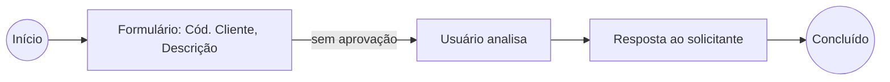

# Crédito (CR)

Sem alçada de aprovação: o usuário analisa e responde.

```mermaid
flowchart LR
    START((Início)) --> FORM["Formulário: Cód. Cliente, Descrição"]
    FORM -->|sem aprovação| USR[Usuário analisa]
    USR --> RESP[Resposta ao solicitante]
    RESP --> FIM((Concluído))
```
